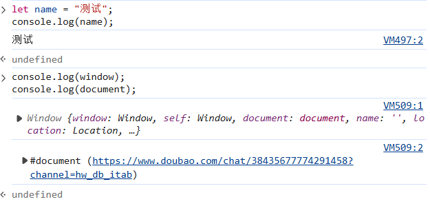
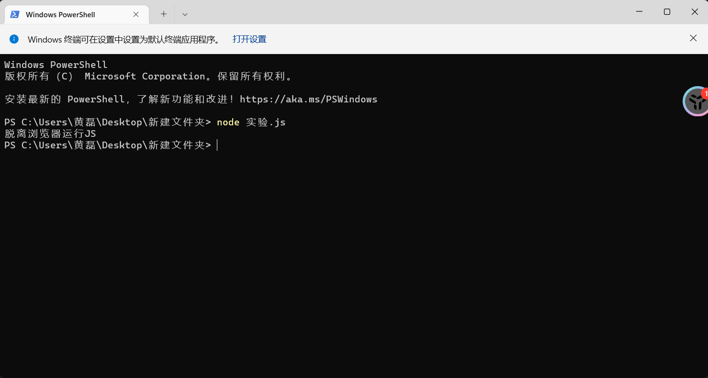

# 探索实验验证：在浏览器之外运行JavaScript

## 实验目标

1. 弄清：JS是不是一定需要浏览器才能运行

2. 区分“JS基础语法”和“浏览器专属功能”

3. 做对比实验看这两者的区别

## 实验准备

- 电脑一台，安装Node.js(下载地址：https://nodejs.org/)

- 打开终端或者cmd，输入：node -v
出现版本号 = 成功

第一阶段：对照组：在浏览器里运行JS

1. 打开 edge浏览器，按f12调出控制台

2. 输入以下两段代码，观察结果

```js
let name = "测试"；
console.log(name);

//代码2：浏览器独有的东西
console.log(window);
console.log(document);
```

现象：两段代码都可以显示，windows和document都可以打印

实验结果图：



## 第二阶段：浏览器之外运行JS

### 步骤一：新建文件夹

- 桌面新建文本文档改后缀(.js)

let name = "脱离浏览器运行JS"；
console.log(name);

### 步骤二：运行脚本

1. 在文件夹地址栏输入.cmd回车，打开命令窗口

2. 输入命令运行文件

- node test.js

- 证明：基础JavaScript语法不需要浏览器

运行结果：
